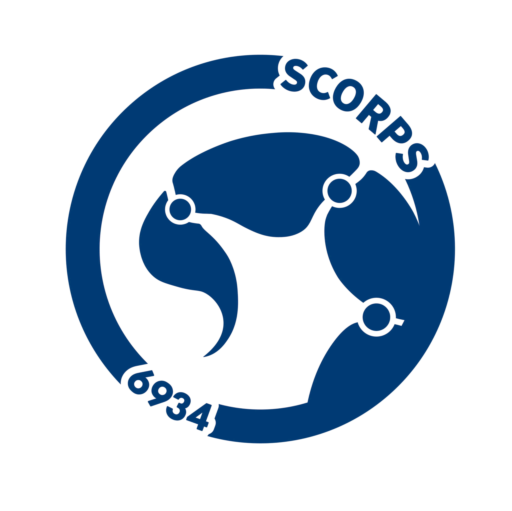

# Description: 
Code for the prototype shooter in development by FRC team 6934.

## Instructions
- If you haven't already, follow the instructions [here](https://docs.google.com/document/d/1eedUyfvkjzmU6tbYUwKPUUhlUWrYmRvimY3AveSH14w/edit?tab=t.0) first.
- Make sure the motor IDs in code match those read by Phoenix Tuner X.
- By going into Constants, you can change each motor's voltage by setting them anywhere from 0-12.

## Credits
- Code Created By: Derek Chang
- Robot Created By: FRC Robotics Team 6934 (ACHS Scorpions)  

## Control Bindings  
### Weapons Controller (**PORT 0**):   
- Intake & Shoot/Reverse Intake *MOVE* Left Joystick (y-axis)
  
## General Hardware Information
### Motors
- Kraken X44
- Kraken X60
(The X60 can be swapped out for any other form-factor-equivalent motor running TalonFX software, such as a Falcon.)

